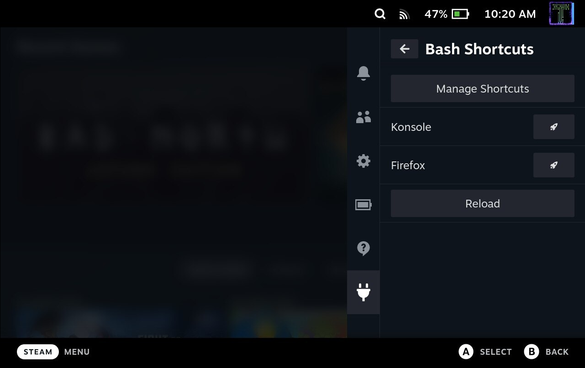

# Bash Shortcuts Plugin

A plugin for creating and managing shortcuts that can be launched from the Quick Access Menu! Uses bash under the hood to run commands, hence the name.

# Overview
This plugin allows you to create shortcuts that can be run from the Quick Access Menu.

The plugin has a default shortcut to launch Konsole (the default teminal installed on the steamdeck). Feel free to remove it.

# Installation
1. [Install the Decky plugin loader](https://github.com/SteamDeckHomebrew/decky-loader#installation)
2. Use the built in plugin store to download the Bash Shortcuts Plugin